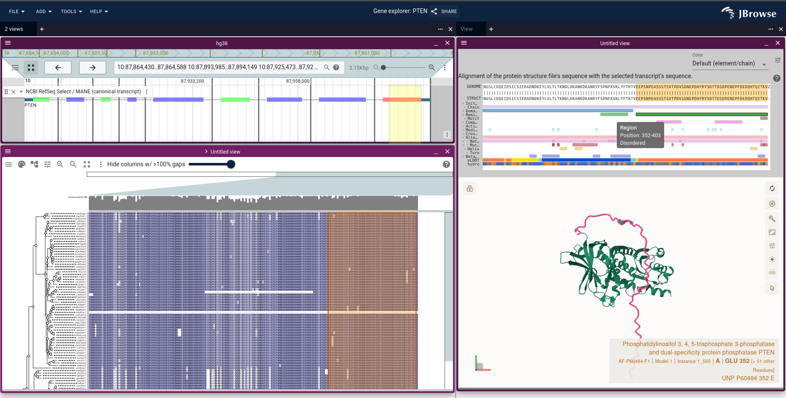
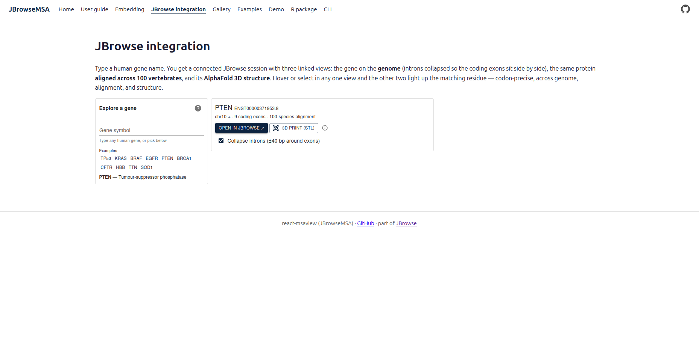

# proteinbrowser

This repository collects the demos, JBrowse 2 plugins and source repositories
behind our paper "Proteins in the Genome Browser," published in the _Journal of
Molecular Biology_. The paper's abstract points here.

If you find these tools useful, please cite our work:

> Diesh, C., Stevens, G., Bridge, C., Hogue, G., Buels, R., Cain, S., Stein, L.,
> & Holmes, I. (2026). Proteins in the Genome Browser: Integration of
> Phylogenies, Alignments, and Structures With Nucleotide-level Evidence in
> JBrowse 2. _Journal of Molecular Biology_, 438(18), 169645.
> https://doi.org/10.1016/j.jmb.2026.169645

[CITATION.cff](CITATION.cff) carries the same reference in machine-readable
form.

## Featured demo

The [Protein Browser](https://staging.genomes.jbrowse.org/protein-browser/)
takes a gene symbol and opens a connected JBrowse 2 session: the coding exons
back to back in a linear genome view, an AlphaFold or PDB structure, and a
cross-species protein alignment. Hover a residue and its codon lights up in
every view. The page reads a `?gene=` parameter, so
[?gene=PTEN](https://staging.genomes.jbrowse.org/protein-browser/?gene=PTEN)
arrives with the gene already resolved. The demo is on the staging site today,
and moves to genomes.jbrowse.org when it ships.

## Screenshots

JBrowseMSA has a launcher of its own that builds the same three views. It is not
deployed yet:

## The paper's figures

The sessions below open on a hosted JBrowse 2 that already loads the msaview and
protein3d plugins, so they need no setup.

| Figure                | What it shows                                                                                    | Open it                                                      |
| --------------------- | ------------------------------------------------------------------------------------------------ | ------------------------------------------------------------ |
| 1A                    | BRAF V600 on the AlphaFold structure, with the ClinVar melanoma variants beside it in the genome | [connected session][fig1a]                                   |
| 1B                    | The same V600 position in a 100-way vertebrate protein alignment                                 | [Protein Browser on BRAF][braf] → **Open in JBrowse**        |
| 1C                    | BRAF's UniProt annotations as tracks in protein coordinates, AlphaMissense among them            | the click-path below                                         |
| 1D                    | Human and mouse PTEN AlphaFold predictions superposed                                            | [connected session][fig1d]                                   |
| Supp. Fig. 1, Table 1 | JBrowseMSA against JalviewJS, Wasabi and biojs-msa on large alignments                           | [msa-viewer-bench](https://github.com/GMOD/msa-viewer-bench) |

The BRAF launch opens the paper's case study in one session: the coding exons
back to back, the AlphaFold model, the 100-way alignment, and the ClinVar and
AlphaMissense tracks in genome coordinates.

Figure 1C has no session URL: its view has no assembly until the plugin builds
one. Right-click the gene on [genomes.jbrowse.org](https://genomes.jbrowse.org),
choose **Launch protein view**, then the arrow beside **Launch** → **Launch 1D
protein annotation view**. The plugin registers the UniProt accession as an
assembly whose reference sequence is the amino-acid sequence, and adds a track
per UniProt feature type alongside AlphaFold pLDDT and AlphaMissense scores.

## Other ways to access the protein browser

- [genomes.jbrowse.org](https://genomes.jbrowse.org) — a JBrowse 2 instance for
  every UCSC genome, each with the 3-D protein structure and MSA plugins loaded.
  Right-click any gene to launch an MSA or a 3-D protein viewer.
- [Ensembl Compara and TreeFam browser](https://jbrowse.org/demos/msafam/) —
  loads gene trees and alignments from Ensembl Compara and TreeFam, and runs
  JBrowseMSA standalone, outside a genome browser.
- [Uniprot Browser](https://cmdcolin.github.io/uniprot_browser) — queries the
  UniProt API for protein annotations.

The JBrowse 2 documentation walks the whole click-path in
[Proteins on genomes.jbrowse.org](https://jbrowse.org/jb2/docs/tutorials/genomes_proteins/),
from the right-click launcher to reading a conserved-domain overlay.

## Software

Everything the paper describes is open source, and each piece is reusable on its
own.

| Repository                                                                   | What it is                                                                                                      |
| ---------------------------------------------------------------------------- | --------------------------------------------------------------------------------------------------------------- |
| [jbrowse-plugin-protein3d](https://github.com/GMOD/jbrowse-plugin-protein3d) | Mol\* 3-D structure views inside JBrowse 2, with AlphaFold DB and UniProt lookups                               |
| [jbrowse-plugin-msaview](https://github.com/GMOD/jbrowse-plugin-msaview)     | JBrowseMSA inside JBrowse 2, with NCBI BLAST and ortholog workflows                                             |
| [JBrowseMSA](https://github.com/GMOD/JBrowseMSA)                             | The MSA viewer itself: a React component, published to npm and packaged as a script tag, an R package and a CLI |
| [g2p_mapper](https://github.com/GMOD/g2p_mapper)                             | The genome-to-protein mapper: transcript CDS ↔ structure residues, including the pairwise fallback              |
| [msa-viewer-bench](https://github.com/GMOD/msa-viewer-bench)                 | The benchmark harness behind Supplementary Figure 1 and Table 1                                                 |
| [jbrowse-components](https://github.com/GMOD/jbrowse-components)             | JBrowse 2 itself, which the two plugins extend                                                                  |

Users can install both plugins from the in-app plugin store, and administrators
can add them to a `config.json` so they load for everyone.

## Data and services

The demos hold almost no protein data of their own. Each one resolves what it
shows per gene, from these services:

- [AlphaFold DB](https://alphafold.ebi.ac.uk/) — predicted structures, one query
  per UniProt accession
- [3D-Beacons](https://www.ebi.ac.uk/pdbe/pdbe-kb/3dbeacons/) and
  [RCSB PDB](https://www.rcsb.org/) — experimental structures and the UniProt
  range each one covers
- [UniProt](https://www.uniprot.org/) — accession mapping, and the annotations
  the 1-D protein view draws
- [NCBI Datasets](https://www.ncbi.nlm.nih.gov/datasets/) — gene records,
  transcripts, and the ortholog report an alignment's rows come from
- [NCBI BLAST](https://blast.ncbi.nlm.nih.gov/) — the in-app search that
  recruits sequences for a gene with no ortholog record
- [NCBI Conserved Domain Database](https://www.ncbi.nlm.nih.gov/Structure/cdd/cdd.shtml)
  and [InterProScan](https://www.ebi.ac.uk/interpro/) — the domain overlay on an
  alignment
- [EBI Clustal Omega](https://www.ebi.ac.uk/jdispatcher/msa/clustalo) — the
  aligner behind an alignment built on demand
- [UCSC Genome Browser](https://genome.ucsc.edu/) — the assemblies, the gene,
  ClinVar and AlphaMissense tracks, and the 100-way vertebrate alignment

## User and developer guide

User guide and developer docs for JBrowseMSA are at
https://gmod.org/JBrowseMSA/.

## Contact

Please [contact us](https://jbrowse.org/jb2/contact) or open a GitHub issue if
you have any questions or bug reports.

[fig1a]:
  https://jbrowse.org/code/jb2/latest/?config=%2Fucsc%2Fhg38%2Fconfig.json&session=spec-%7B%22views%22%3A%5B%7B%22type%22%3A%22ProteinView%22%2C%22structures%22%3A%5B%7B%22uniprotId%22%3A%22P15056%22%2C%22initialResidues%22%3A%7B%22start%22%3A600%2C%22end%22%3A600%7D%7D%5D%2C%22transcriptId%22%3A%22NM_004333.6%22%2C%22sideBySide%22%3Atrue%2C%22zoomToBaseLevel%22%3Afalse%2C%22connectedView%22%3A%7B%22assembly%22%3A%22hg38%22%2C%22loc%22%3A%22chr7%3A140%2C753%2C280-140%2C753%2C400%22%2C%22tracks%22%3A%5B%22hg38-ncbiRefSeqSelect%22%2C%22hg38-clinvarMain%22%5D%7D%7D%5D%7D
[fig1d]:
  https://jbrowse.org/code/jb2/latest/?config=%2Fucsc%2Fhg38%2Fconfig.json&session=spec-%7B%22views%22%3A%5B%7B%22type%22%3A%22ProteinView%22%2C%22structures%22%3A%5B%7B%22uniprotId%22%3A%22P60484%22%7D%2C%7B%22uniprotId%22%3A%22O08586%22%7D%5D%2C%22transcriptId%22%3A%22NM_000314.8%22%2C%22sideBySide%22%3Atrue%2C%22connectedView%22%3A%7B%22assembly%22%3A%22hg38%22%2C%22loc%22%3A%22chr10%3A87%2C863%2C625-87%2C971%2C930%22%2C%22tracks%22%3A%5B%22hg38-ncbiRefSeqSelect%22%5D%7D%7D%5D%7D
[braf]: https://staging.genomes.jbrowse.org/protein-browser/?gene=BRAF
